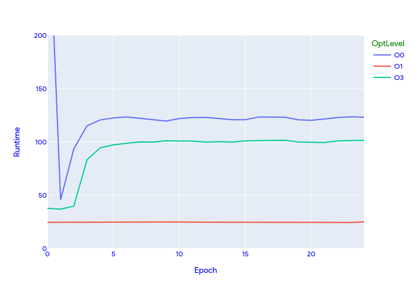

# Note
The original repository is https://github.com/fxia22/pointnet.pytorch. 
My additional work in this project includes:
1. using AMP/APEX to accelerating training procedure.
1. introducing TensorRT to accelerating the inference procedure with INT8/FP16/TF32/FP32.

# PointNet.pytorch
This repo is implementation for PointNet(https://arxiv.org/abs/1612.00593) in pytorch. The model is in `pointnet/model.py`. It is tested with pytorch-1.0.

# Download data and running

```
git clone https://github.com/fxia22/pointnet.pytorch
cd pointnet.pytorch
pip install -e .
```

Download and build visualization tool
```
cd script
bash build.sh #build C++ code for visualization
bash download.sh #download dataset
```

Training 
```
cd utils
python train_classification.py --dataset <dataset path> --nepoch=<number epochs> --dataset_type <modelnet40 | shapenet>
python train_segmentation.py --dataset <dataset path> --nepoch=<number epochs> 
```

Use `--feature_transform` to use feature transform.

# Performance

## Training performance


* without amp: current epoch used time: 286.7861454486847 seconds
* with amp O1: current epoch used time: 48.52956676483154 seconds
* with amp O3: current epoch used time: 47.27082324028015 seconds

## Classification performance

On ModelNet40:

|  | Overall Acc | 
| :---: | :---: | 
| Original implementation | 89.2 | 
| this implementation(w/o feature transform) | 86.4 | 
| this implementation(w/ feature transform) | 87.0 | 

On [A subset of shapenet](http://web.stanford.edu/~ericyi/project_page/part_annotation/index.html)

|  | Overall Acc | 
| :---: | :---: | 
| Original implementation | N/A | 
| this implementation(w/o feature transform) | 98.1 | 
| this implementation(w/ feature transform) | 97.7 | 


## Training using APEX/AMP

> Explanation[https://nvidia.github.io/apex/amp.html]:
> 1. O0[FP32 training]: Your incoming model should be FP32 already, so this is likely a no-op. O0 can be useful to establish an accuracy baseline.
> 2. O1[Mixed Precision (recommended for typical use)]: Patch all Torch functions and Tensor methods to cast their inputs according to a whitelist-blacklist model. Whitelist ops (for example, Tensor Core-friendly ops like GEMMs and convolutions) are performed in FP16. Blacklist ops that benefit from FP32 precision (for example, softmax) are performed in FP32. O1 also uses dynamic loss scaling, unless overridden.
> 3. O2[“Almost FP16” Mixed Precision]: O2 casts the model weights to FP16, patches the model’s forward method to cast input data to FP16, keeps batchnorms in FP32, maintains FP32 master weights, updates the optimizer’s param_groups so that the optimizer.step() acts directly on the FP32 weights (followed by FP32 master weight->FP16 model weight copies if necessary), and implements dynamic loss scaling (unless overridden). Unlike O1, O2 does not patch Torch functions or Tensor methods.
> 4. O3[FP16 training]: O3 may not achieve the stability of the true mixed precision options O1 and O2. However, it can be useful to establish a speed baseline for your model, against which the performance of O1 and O2 can be compared. If your model uses batch normalization, to establish “speed of light” you can try O3 with the additional property override keep_batchnorm_fp32=True (which enables cudnn batchnorm, as stated earlier).

### Running time comparison


#### Explanation
1. as excepted, O1 level has better and more stable performance then O0 level;
1. O3 is only used as running speed baseline. In this case, the loss function outputs NaN value, which is invalid to update the network for the optimizer. 
1. unable to run the O1 level due to following error. Note: pytorch-rocm has no such issue, need further investigation.
 ```log
 Traceback (most recent call last):
  File "~/point-cloud/pointnet.pytorch/code/utils/train_classification.py", line 117, in <module>
    pred, trans, trans_feat = classifier(points)
  File "/home/noname/anaconda3/envs/pytorch-cuda/lib/python3.9/site-packages/torch/nn/modules/module.py", line 1130, in _call_impl
    return forward_call(*input, **kwargs)
  File "~/point-cloud/pointnet.pytorch/code/utils/../pointnet/model.py", line 147, in forward
    x, trans, trans_feat = self.feat(x)
  File "/home/noname/anaconda3/envs/pytorch-cuda/lib/python3.9/site-packages/torch/nn/modules/module.py", line 1130, in _call_impl
    return forward_call(*input, **kwargs)
  File "~/point-cloud/pointnet.pytorch/code/utils/../pointnet/model.py", line 106, in forward
    trans = self.stn(x)
  File "/home/noname/anaconda3/envs/pytorch-cuda/lib/python3.9/site-packages/torch/nn/modules/module.py", line 1130, in _call_impl
    return forward_call(*input, **kwargs)
  File "~/point-cloud/pointnet.pytorch/code/utils/../pointnet/model.py", line 32, in forward
    x = F.relu(self.bn1(self.conv1(x)))
  File "/home/noname/anaconda3/envs/pytorch-cuda/lib/python3.9/site-packages/torch/nn/modules/module.py", line 1130, in _call_impl
    return forward_call(*input, **kwargs)
  File "/home/noname/anaconda3/envs/pytorch-cuda/lib/python3.9/site-packages/torch/nn/modules/conv.py", line 307, in forward
    return self._conv_forward(input, self.weight, self.bias)
  File "/home/noname/anaconda3/envs/pytorch-cuda/lib/python3.9/site-packages/torch/nn/modules/conv.py", line 303, in _conv_forward
    return F.conv1d(input, weight, bias, self.stride,
  File "/home/noname/anaconda3/envs/pytorch-cuda/lib/python3.9/site-packages/apex/amp/wrap.py", line 21, in wrapper
    args[i] = utils.cached_cast(cast_fn, args[i], handle.cache)
  File "/home/noname/anaconda3/envs/pytorch-cuda/lib/python3.9/site-packages/apex/amp/utils.py", line 97, in cached_cast
    if cached_x.grad_fn.next_functions[1][0].variable is not x:
IndexError: tuple index out of range
```

### Accuracy comparison
|  | Overall Accuracy | 
| :---: | :---: | 
| O0 | 0.9578983994432846 | 
| O1 | N/A | 
| O2 | 0.976687543493389 | 
| O3 | 0.1186499652052888 | 

#### Summary

1. O0 is used as the accuracy baseline, and it reach 95.7% accuracy.
1. Since O3 training fails to produce meaningful loss, optimizer also fails to propagate the training loss. The network remained untrained. So the result is not better than random guess.
1. O2 has achieved the best accuracy. So we are going to use this trained network to generate the TensorRT engine files.

## Inference using TensorRT

### Throughput of INT8 Engine 
```cpp
[07/29/2022-01:16:29] [I] === Performance summary ===
[07/29/2022-01:16:29] [I] Throughput: 640777 qps
[07/29/2022-01:16:29] [I] Latency: min = 27.4854 ms, max = 124.657 ms, mean = 97.6132 ms, median = 102.305 ms, percentile(99%) = 116.434 ms
[07/29/2022-01:16:29] [I] Enqueue Time: min = 0.0397949 ms, max = 0.223877 ms, mean = 0.053646 ms, median = 0.0440569 ms, percentile(99%) = 0.162476 ms
[07/29/2022-01:16:29] [I] H2D Latency: min = 0.332413 ms, max = 3.64624 ms, mean = 0.863565 ms, median = 0.350952 ms, percentile(99%) = 3.62695 ms
[07/29/2022-01:16:29] [I] GPU Compute Time: min = 27.0518 ms, max = 123.227 ms, mean = 96.7286 ms, median = 101.81 ms, percentile(99%) = 114.215 ms
[07/29/2022-01:16:29] [I] D2H Latency: min = 0.00805664 ms, max = 0.0943604 ms, mean = 0.0209501 ms, median = 0.0175781 ms, percentile(99%) = 0.0773315 ms
[07/29/2022-01:16:29] [I] Total Host Walltime: 7.97751 s
[07/29/2022-01:16:29] [I] Total GPU Compute Time: 60.3587 s
[07/29/2022-01:16:29] [W] * GPU compute time is unstable, with coefficient of variance = 18.2805%.
[07/29/2022-01:16:29] [W]   If not already in use, locking GPU clock frequency or adding --useSpinWait may improve the stability.
[07/29/2022-01:16:29] [I] Explanations of the performance metrics are printed in the verbose logs.
```

### Accuracy of INT8 Engine 
final accuracy 0.9752957550452331

### Throughput of FP16 Engine 
```cpp
[07/29/2022-01:15:05] [I] === Performance summary ===
[07/29/2022-01:15:05] [I] Throughput: 641261 qps
[07/29/2022-01:15:05] [I] Latency: min = 27.4814 ms, max = 121.777 ms, mean = 97.5011 ms, median = 102.247 ms, percentile(99%) = 114.755 ms
[07/29/2022-01:15:05] [I] Enqueue Time: min = 0.0400391 ms, max = 0.186523 ms, mean = 0.0542541 ms, median = 0.0444336 ms, percentile(99%) = 0.142578 ms
[07/29/2022-01:15:05] [I] H2D Latency: min = 0.332458 ms, max = 3.66357 ms, mean = 0.857784 ms, median = 0.349609 ms, percentile(99%) = 3.61523 ms
[07/29/2022-01:15:05] [I] GPU Compute Time: min = 27.1294 ms, max = 120.013 ms, mean = 96.6216 ms, median = 101.69 ms, percentile(99%) = 113.714 ms
[07/29/2022-01:15:05] [I] D2H Latency: min = 0.00878906 ms, max = 0.0864258 ms, mean = 0.0216703 ms, median = 0.0180664 ms, percentile(99%) = 0.0756836 ms
[07/29/2022-01:15:05] [I] Total Host Walltime: 7.95872 s
[07/29/2022-01:15:05] [I] Total GPU Compute Time: 60.1952 s
[07/29/2022-01:15:05] [W] * GPU compute time is unstable, with coefficient of variance = 18.2284%.
[07/29/2022-01:15:05] [W]   If not already in use, locking GPU clock frequency or adding --useSpinWait may improve the stability.
[07/29/2022-01:15:05] [I] Explanations of the performance metrics are printed in the verbose logs.
[07/29/2022-01:15:05] [V]
```

### Accuracy of FP16 Engine 
final accuracy 0.9749478079331941

### Throughput of TF32 Engine 
```cpp
[07/29/2022-01:19:03] [I] === Performance summary ===
[07/29/2022-01:19:03] [I] Throughput: 640379 qps
[07/29/2022-01:19:03] [I] Latency: min = 28.6321 ms, max = 118.012 ms, mean = 97.4721 ms, median = 102.356 ms, percentile(99%) = 115.409 ms
[07/29/2022-01:19:03] [I] Enqueue Time: min = 0.0400391 ms, max = 0.303223 ms, mean = 0.0560361 ms, median = 0.0447388 ms, percentile(99%) = 0.158691 ms
[07/29/2022-01:19:03] [I] H2D Latency: min = 0.335938 ms, max = 3.62866 ms, mean = 0.892099 ms, median = 0.354248 ms, percentile(99%) = 3.60693 ms
[07/29/2022-01:19:03] [I] GPU Compute Time: min = 28.1935 ms, max = 117.655 ms, mean = 96.5586 ms, median = 101.875 ms, percentile(99%) = 114.048 ms
[07/29/2022-01:19:03] [I] D2H Latency: min = 0.0078125 ms, max = 0.106201 ms, mean = 0.0214461 ms, median = 0.0180664 ms, percentile(99%) = 0.0722656 ms
[07/29/2022-01:19:03] [I] Total Host Walltime: 7.99527 s
[07/29/2022-01:19:03] [I] Total GPU Compute Time: 60.3491 s
[07/29/2022-01:19:03] [W] * GPU compute time is unstable, with coefficient of variance = 18.5196%.
[07/29/2022-01:19:03] [W]   If not already in use, locking GPU clock frequency or adding --useSpinWait may improve the stability.
[07/29/2022-01:19:03] [I] Explanations of the performance metrics are printed in the verbose logs.
[07/29/2022-01:19:03] [V]
```

### Accuracy of TF32 Engine 
final accuracy 0.97633959638135


### Throughput of FP32 Engine 
```cpp
[07/29/2022-01:18:09] [I] === Performance summary ===
[07/29/2022-01:18:09] [I] Throughput: 641470 qps
[07/29/2022-01:18:09] [I] Latency: min = 27.3369 ms, max = 121.641 ms, mean = 97.3984 ms, median = 102.28 ms, percentile(99%) = 117.303 ms
[07/29/2022-01:18:09] [I] Enqueue Time: min = 0.0395508 ms, max = 0.15918 ms, mean = 0.0509855 ms, median = 0.0441895 ms, percentile(99%) = 0.130371 ms
[07/29/2022-01:18:09] [I] H2D Latency: min = 0.333313 ms, max = 3.63818 ms, mean = 0.886899 ms, median = 0.353027 ms, percentile(99%) = 3.60596 ms
[07/29/2022-01:18:09] [I] GPU Compute Time: min = 26.9731 ms, max = 121.27 ms, mean = 96.4886 ms, median = 101.631 ms, percentile(99%) = 113.709 ms
[07/29/2022-01:18:09] [I] D2H Latency: min = 0.0078125 ms, max = 0.108307 ms, mean = 0.0228823 ms, median = 0.019043 ms, percentile(99%) = 0.079834 ms
[07/29/2022-01:18:09] [I] Total Host Walltime: 7.98167 s
[07/29/2022-01:18:09] [I] Total GPU Compute Time: 60.3054 s
[07/29/2022-01:18:09] [W] * GPU compute time is unstable, with coefficient of variance = 18.6894%.
[07/29/2022-01:18:09] [W]   If not already in use, locking GPU clock frequency or adding --useSpinWait may improve the stability.
[07/29/2022-01:18:09] [I] Explanations of the performance metrics are printed in the verbose logs.
```

### Accuracy of FP32 Engine 
final accuracy 0.975991649269311

## Conclusion

1. In term of throughput, FP16/FP32 has better performance.
2. In term of accuracy, all engines are relatively close, that is, 97.5%-97.6%.

## Segmentation performance

Segmentation on  [A subset of shapenet](http://web.stanford.edu/~ericyi/project_page/part_annotation/index.html).

| Class(mIOU) | Airplane | Bag| Cap|Car|Chair|Earphone|Guitar|Knife|Lamp|Laptop|Motorbike|Mug|Pistol|Rocket|Skateboard|Table
| :---: | :---: | :---: | :---: | :---: | :---: | :---: | :---: | :---: | :---: | :---: | :---: | :---: | :---: | :---: | :---: | :---: | 
| Original implementation |  83.4 | 78.7 | 82.5| 74.9 |89.6| 73.0| 91.5| 85.9| 80.8| 95.3| 65.2| 93.0| 81.2| 57.9| 72.8| 80.6| 
| this implementation(w/o feature transform) | 73.5 | 71.3 | 64.3 | 61.1 | 87.2 | 69.5 | 86.1|81.6| 77.4|92.7|41.3|86.5|78.2|41.2|61.0|81.1|
| this implementation(w/ feature transform) |  |  |  |  | 87.6 |  | | | | | | | | | |81.0|

Note that this implementation trains each class separately, so classes with fewer data will have slightly lower performance than reference implementation.

Sample segmentation result:


# Links

- [Project Page](http://stanford.edu/~rqi/pointnet/)
- [Tensorflow implementation](https://github.com/charlesq34/pointnet)
